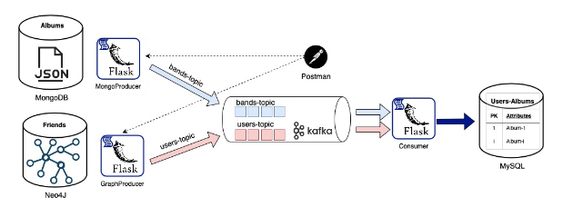

# ETL Mechanism with REST Service and Data Pipeline Integration



This project involves the development of an Extract Transform Load (ETL) mechanism implemented in Python 3. The ETL mechanism retrieves data from two different types of databases (DB), namely MongoDB and Neo4j, consolidates and processes the data, and finally stores it in a third MySQL Database.

## Overview
The ETL mechanism operates as a REST service, facilitating monitoring through REST requests. Users can select the data to be retrieved, and the mechanism performs data fusion before storing the results in the target Database.

## Implementation Details
Programming Language: Python 3

Source Databases: MongoDB, Neo4j

Target Database: MySQL

REST Service: Implemented using the Flask Framework

Data Pipeline and Integration: Utilizes Apache Kafka

## Docker Compose Configuration
 

This Docker Compose configuration file (`docker-compose.yml`) sets up a development environment with containers for MySQL, Neo4j, MongoDB, Kafka, and Zookeeper. These containers can be used individually or together, depending on your application requirements.
 

### Services

#### API
```bash

curl --location 'localhost:5000/publish/bands' \
--header 'Content-Type: application/json' \
--data '{
    "start_date": "2000-01-01",
    "end_date": "2023-01-01"
}'

curl --location 'localhost:5000/publish/users' \
--header 'Content-Type: application/json' \
--data '{
    "user_name": "koukos"
}'

```

#### MySQL
  

```sql
-- Create user and grant privillages
CREATE USER 'etl'@'%' IDENTIFIED BY 'my_etl_project';
GRANT SELECT, INSERT, UPDATE, DELETE, CREATE, ALTER, DROP, REFERENCES ON `MusicNetworkDB`.* TO 'etl'@'%';


-- Create bands table
CREATE TABLE bands (
    BandID VARCHAR(255) PRIMARY KEY,
    BandName VARCHAR(255)
);

-- Create users table
CREATE TABLE users (
    UserID INT PRIMARY KEY AUTO_INCREMENT,
    UserName VARCHAR(255),
    BandID VARCHAR(255),
    FOREIGN KEY (BandID) REFERENCES bands(BandID)
);

-- Create albums table
CREATE TABLE albums (
    AlbumID INT PRIMARY KEY AUTO_INCREMENT,
    BandID VARCHAR(255),
    AlbumName VARCHAR(255),
    ReleaseDate DATE,
    FOREIGN KEY (BandID) REFERENCES bands(BandID)
);

-- Needed query
SELECT users.UserName, bands.BandName, albums.AlbumName, albums.ReleaseDate
FROM users
JOIN bands ON users.BandID = bands.BandID
JOIN albums ON bands.BandID = albums.BandID;


```

  

#### Neo4j

  
```bash
##### Create nodes for users & friendship relationships


CREATE (user1:User {name: 'koukos', favorite_bands: ['Bring Me The Horizon', 'Radiohead']})

CREATE (user2:User {name: 'matsapliokos', favorite_bands: ['Radiohead', 'Viagra Boys', 'Interpol', 'UNKLE']})

CREATE (user3:User {name: 'korompos', favorite_bands: ['Bring Me The Horizon', 'Viagra Boys', 'Metallica']})

CREATE (user4:User {name: 'gabriella', favorite_bands: ['Bauhaus', 'Depeche Mode']})

CREATE (user5:User {name: 'maria', favorite_bands: ['Sonic Youth']})

  

CREATE (user1)-[:FRIEND]->(user2)
CREATE (user2)-[:FRIEND]->(user1)
CREATE (user1)-[:FRIEND]->(user3)
CREATE (user3)-[:FRIEND]->(user1)
CREATE (user2)-[:FRIEND]->(user3)
CREATE (user3)-[:FRIEND]->(user2)
CREATE (user5)-[:FRIEND]->(user3)
CREATE (user3)-[:FRIEND]->(user5)

##### Find friends of User1

MATCH (user1:User {name: 'koukos'})-[:FRIEND]-(friend)
RETURN user1, friend  

#### Show all nodes and relationships in the graph
MATCH (n)
RETURN n;

#### Delete all nodes and relationships in the graph
MATCH (n)
DETACH DELETE n;

```
  

#### MongoDB

  

##### Model

  

```javascript

    {

        "band_name": "She Past Away",

        "formation_date": "2006",

        "albums": [

                {

                "album_name":  "Belirdi Gece",

                "release_date":  "2010-12-24"

                },

                {

                "album_name":  "Narin Yalnızlık",

                "release_date":  "2015-12-21"

                },

                {

                "album_name":  "Disko Anksiyete",

                "release_date":  "2019-05-09"

                }

            ]

    }

```

  


#### Kafka

```bash
  
##### List topics

docker exec -it kafka kafka-topics --list --bootstrap-server localhost:9092

  

##### List topicσ data

docker exec -it kafka kafka-console-consumer --topic bands-topic -bootstrap-server localhost:9092 --from-beginning
docker exec -it kafka kafka-console-consumer --topic users-topic -bootstrap-server localhost:9092 --from-beginning

  

##### Delete topics

docker exec -it kafka kafka-topics --delete --topic bands-topic --bootstrap-server localhost:9092
docker exec -it kafka kafka-topics --delete --topic users-topic --bootstrap-server localhost:9092

```
  

### Volumes

  

-  **mysql_data:** MySQL data volume

-  **mongo_data:** MongoDB data volume

-  **neo4j_data:** Neo4j data volume

  

### Usage

  

1. Make sure you have Docker and Docker Compose installed.

2. Create an `.env` file with the required environment variables (refer to `.env.example` file).

3. Run `docker compose up -d` to start the services.

  

Feel free to customize the configuration based on your specific needs.